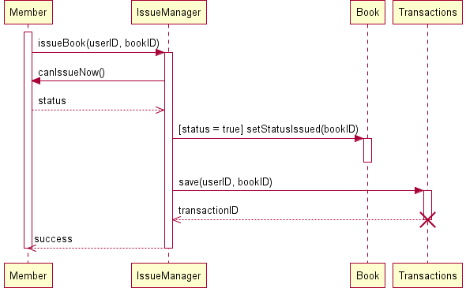

## Case Study

**A Library Information System for SE VLabs Institute**

The SE VLabs Institute has been recently setup to provide state-of-the-art research facilities in the field of Software Engineering. Apart from research scholars (students) and professors, it also includes quite a large number of employees who work on different projects undertaken by the institution.

As the size and capacity of the institute is increasing with the time, it has been proposed to develop a Library Information System (LIS) for the benefit of students and employees of the institute. LIS will enable the members to borrow a book (or return it) with ease while sitting at his desk/chamber. The system also enables a member to extend the date of his borrowing if no other booking for that particular book has been made. For the library staff, this system aids them to easily handle day-to-day book transactions. The librarian, who has administrative privileges and complete control over the system, can enter a new record into the system when a new book has been purchased, or remove a record in case any book is taken off the shelf. Any non-member is free to use this system to browse/search books online. However, issuing or returning books is restricted to valid users (members) of LIS only.

The final deliverable would a web application (using the recent HTML 5), which should run only within the institute LAN. Although this reduces security risk of the software to a large extent, care should be taken no confidential information (eg., passwords) is stored in plain text.

Let us consider the "Issue Book" use case and represent the involved steps in a sequence diagram as shown in figure 1. We assume that the book to be issued is available. An user makes a request to issue a book against his account. This is shown by the "issueBook(bookID)" call from "Member" to "IssueManager" objects. At this point the system checks whether that particular user can issue another book (based on the maximum number of books that he can issue) by invoking the "canIssue()" method on the "Member". As a result of this call, a response ("status") is sent back to the "IssueManager" class. If the "status" is "true" (as indicated in the note), status of the concerned book is set to "issued". A new transaction is saved corresponding to the current issue of book by the user. Finally, a success message is sent back to "Member" indicating that the book was successfully issued.

Figure 1:  Sequence diagram for "Issue Book"

Few points could be noted here. Notes can be used almost anywhere within an UML diagram for whatever purpose. In figure 1 we use a note to specify the condition when status of a book is set to 'issued'. UML 1.0 had used guard conditions to specify such kind of Boolean logic. UML 2.0 provide components to specify the alternate scenarios within a sequence diagram (not discussed here). One can definitely make use of these components. However, if the number of IF-THEN-ELSE conditions in a sequence diagram becomes high, the diagram gets complicated. In such cases one can draw multiple sequence diagrams for alternate conditions.

One key component in figure 1 is the "IssueManager" class. This class doesn't represent the actual Library Information System (LIS). Rather, this is a part of LIS -- a specific module to handle issuing of books to the members.

Also, note that the life cycle of the "Transactions" has been shown as self-destroyed. To understand this, consider how a transaction is actually implemented in code. One creates an object from "Transactions" class, fills it up with all necessary information, and then saves the transaction. Thereafter, the transaction object is not required to be in memory.

Figure 2 shows the order of steps involved in the process of purchasing of a new book. In this case also, "PurchaseManager" is a part of LIS, which manages all books that are being purchased. The activation bars indicate the different instances when a particular object is active in their corresponding life cycles.

Figure 2: Sequence diagram for "Purchase Books"

One may have doubts over the inclusion of "Distributor" class. "Distributor" is not a constituent of the LIS; however, it interacts with LIS. Here "Distributor" is meant to represent the "interface" between LIS and the actual, physical book sellers and distributors. For instance, LIS can store details of distributor XYZ, including it's email address, bank account number, into it's records. Whenever the librarian places a new order to XYZ, the order is being sent electronically to XYZ, processed (possibly with a delay), a corresponding invoice is generated, and sent back to LIS. "placeOrder(orderID)" has been indicated as asynchronous calls since the calling object can continue with other tasks. The books would be dispatched by XYZ physically, which lies outside the boundary of LIS. Once the ordered books have been received, the librarian opts to make payment for his orders, which, too, could happen electronically through Net Banking. Technology has, indeed, made a huge progress!

Finally, at his leisure time, the librarian might consider updating the inventory according to the corresponding order.

 

Classes are the fundamental components of any object oriented design and development. Unless individual class, it's attributes and associated operations have been modeled well, a lot of suffereing could await during the development phase. However, unlike waterfall model, the life cycle in object oriented development is iterative. One builds a model, analyze it's efficiency, and refines it thereafter, if required. Therefore, an analyst, designer, or developer doesn't have the tight constraints to create a perfect art at one go.

Based on conceptual modeling and domain knowledge we already had identified a list of classes. We present them here once again:

- Member
- Book
- Transaction (of books)
- Librarian
- Employee
- Book Inventory
- Distributor
- Order
- Order Line Item
- Payment
- Invoice

Let's focus on the "Member", "Librarian" and "Employee" classes. The "Employee" class could be considered as a parent class, some of whose properties are inherited by the "Member" class. Again, "Librarian" is just a special type of "Member" with certain extra privileges. However, it may be noted here that LIS in no way would be interested to know about employees who are not members of LIS. Moreover, to distinguish between a normal member and a librarian, one could define a set of roles, and assign them appropriately to the members. This approach provides a flexible approach to manage users. For example, if the librarian goes on a leave, another member could be assigned the librarian role temporarily. Therefore, we decide to have a single "Member" class, whose instances could have one or more roles. This is shown in figure 3 with the "association" relationship between "Member" and "Role" classes. The "Role" class could consist of a list of available roles. A list could be maintained in the "Member" class to indicate which roles are associated with a particular instance of it.

Figure 3: A simplified class diagram for LIS

The "LIS" class consists of several modules: "RegistrationManager", "IssueManager" "ReturnManager", and "PurchaseManager". Their "composition" relationship with "LIS" indicates that any of these individual modules wouldn't exist without the existence of "LIS". The "IssueManager" class is responsible for issue and reissue of books while considering the two-times reissue constraint placed on a book.

The relation between "IssueManager" class and "Book" class is shown as "weak dependency". This is due to the reason that the "IssueManager" class do not require a "Book" as it's member variable. Rather, when an user has issued a book, the concerned method in "IssueManager" just needs to update the status of the corresponding book. No instance of "Book" needs to be created. The arrow from "IssueManager" to "Book" indicates that only the former knows about the "Book" class. The relationship between "PurchaseManager" and "Distributor" is, however, not a weak dependency. The "PurchaseManager" class has a member variable of type "Distributor", which keeps track of the distributor selected for the current purchase.

With the classes so identified, the code for issue book could look as follows:

public ID IssueBook(ID userID, ID bookID) {
    Member user = Member.GetMember(userID);
    ID transactionID = null;
    if ( user.canIssueNow() && Book.IsAvailable(bookID) ) {
        Book.SetStatusIssued(bookID);
        user.incrementIssueCount(bookID);
        BookTransaction transaction = new BookTransaction(userID, bookID);        
        transaction.save();
        transactionID = transaction.getID();
    }
    return transactionID;
}

The code for reissuing a book to an user could look like the following.

public ID ReissueBook(ID userID, ID bookID) {
    Member user = Member.GetMember(userID);
    ID transactionID = null;
    if ( user.canIssueNow() && Book.IsAvailable(bookID) ) {        
        Integer count = user.getReissueCountFor(bookID);    // # of times this books has been reissued after it's recent issue by the user
        if ( count < REISSUE_LIMIT ) {        
            user.incrementReissueCount(bookID);
            BookTransaction transaction = new BookTransaction(userID, bookID);        
            transaction.save();
            transactionID = transaction.getID();
        }
    }
    return transactionID;
}