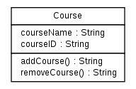
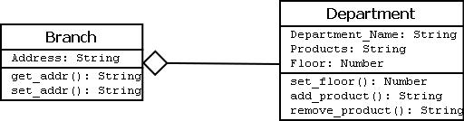
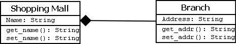
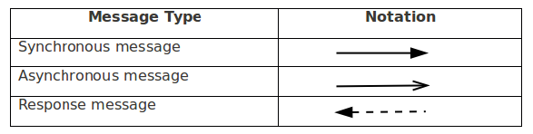

## Objectives

**After completing this experiment you will be able to:**

- Graphically represent a class, and associations among different classes
- Identify the logical sequence of activities undergoing in a system, and represent them pictorially

## Theory

### Structural and Behavioral aspects
Developing a software system in object oriented approach is very much dependent on understanding the problem. Some aspects and the respective models are used to describe problems and in context of those aspects the respective models give a clear idea regarding the problem to a designer. For developer, structural and behavioral aspects are two key aspects to see through a problem to design a solution for the same.

#### Class diagram
It is a graphical representation for describing a system in context of its static construction.

#### Elements in class diagram

Class diagram contains the system classes with its data members, operations and relationships between classes.

#### Class
A set of objects containing similar data members and member functions is described by a class. In UML syntax, class is identified by solid outline rectangle with three compartments which contain

- **Class name**
A class is uniquely identified in a system by its name. A textual string is taken as class name. It lies in the first compartment in class rectangle.

- **Attributes**
Property shared by all instances of a class. It lies in the second compartment in class rectangle.

- **Operations**
An execution of an action can be performed for any object of a class. It lies in the last compartment in class rectangle.

##### Example
To build a structural model for an Educational Organization, ‘Course’ can be treated as a class which contains attributes ‘courseName’ & ‘courseID’ with the operations ‘addCourse()’ & ‘removeCourse()’ allowed to be performed for any object to that class.

Figure - 1

- **Generalization/Specialization**
It describes how one class is derived from another class. Derived class inherits the properties of its parent class.

##### Example

Figure - 2

Geometric_Shapes is the class that describes how many sides a particular shape has. Triangle, Quadrilateral and Pentagon are the classes that inherit the property of the Geometric_Shapes class. So the relations among these classes are generalization. Now Equilateral_Triangle, Isosceles_Triangle and Scalene_Triangle, all these three classes inherit the properties of Triangle class as each one of them has three sides. So, these are specialization of Triangle class.

### Relationships
Existing relationships in a system describe legitimate connections between the classes in that system.

- **Association**
It is an instance level relationship[i] that allows exchanging messages among the objects of both ends of association. A simple straight line connecting two class boxes represent an association. We can give a name to association and also at the both end we may indicate role names and multiplicity of the adjacent classes. Association may be uni-directional.

##### Example

In structure model for a system of an organization an employee (instance of ‘Employee’ class) is always assigned to a particular department (instance of ‘Department’ class) and the association can be shown by a line connecting the respective classes.

Figure - 3

- **Aggregation**
It is a special form of association which describes a part-whole[i] relationship between a pair of classes. It means, in a relationship, when a class holds some instances of related class, then that relationship can be designed as an aggregation.

##### Example

For a supermarket in a city, each branch runs some of the departments they have. So, the relation among the classes ‘Branch’ and ‘Department’ can be designed as an aggregation. In UML, it can be shown as in the fig. below

Figure - 4

-**Composition**

It is a strong from of aggregation which describes that whole is completely owns its part. Life cycle of the part depends on the whole.

##### Example

Let consider a shopping mall has several branches in different locations in a city. The existence of branches completely depends on the shopping mall as if it is not exist any branch of it will no longer exists in the city. This relation can be described as composition and can be shown as below

Figure - 5

-**Multiplicity **

It describes how many numbers of instances of one class is related to the number of instances of another class in an association.

#### **Notation for different types of multiplicity:**

Instance|Multiplicity
:--|:--|
Single instance |  1
Zero or one instance |  0..1
Zero or more instance |  0..*
One or more instance |  1..*
Particular range (two to six) |  2..6

#### Example

One vehicle may have two or more wheels

Figure - 6

### Sequence diagram

It represents the behavioral aspects of a system. Sequence diagram shows the interactions between the objects by means of passing messages from one object to another with respect to time in a system.

#### Elements in sequence diagram
Sequence diagram contains the objects of a system and their life-line bar and the messages passing between them.

#### Object
Objects appear at the top portion of sequence diagram. Object is shown in a rectangle box. Name of object precedes a colon ‘:’ and the class name, from which the object is instantiated. The whole string is underlined and appears in a rectangle box. Also, we may use only class name or only instance name.

Objects which are created at the time of execution of use case and are involved in message passing , are appear in diagram, at the point of their creation.

#### Life-line bar
A down-ward vertical line from object-box is shown as the life-line of the object. A rectangle bar on life-line indicates that it is active at that point of time.

#### Messages
Messages are shown as an arrow from the life-line of sender object to the life-line of receiver object and labeled with the message name. Chronological order of the messages passing throughout the objects’ life-line show the sequence in which they occur. There may exist some different types of messages :
- **Synchronous messages:** Receiver start processing the message after receiving it and sender needs to wait until it is made. A straight arrow with close and fill arrow-head from sender life-line bar to receiver end, represent a synchronous message.
- **Asynchronous messages:** For asynchronous message sender needs not to wait for the receiver to process the message. A function call that creates thread can be represented as an asynchronous message in sequence diagram. A straight arrow with open arrow-head from sender life-line bar to receiver end, represent an asynchronous message.
- **Return message:** For a function call when we need to return a value to the object, from which it was called, then we use return message. But, it is optional, and we are using it when we are going to model our system in much detail. A dashed arrow with open arrow-head from sender life-line bar to receiver end, represent that message.
- **Response message:** One object can send a message to self. We use this message when we need to show the interaction between the same object.

Figure - 7

